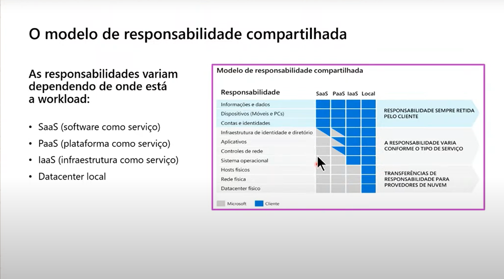
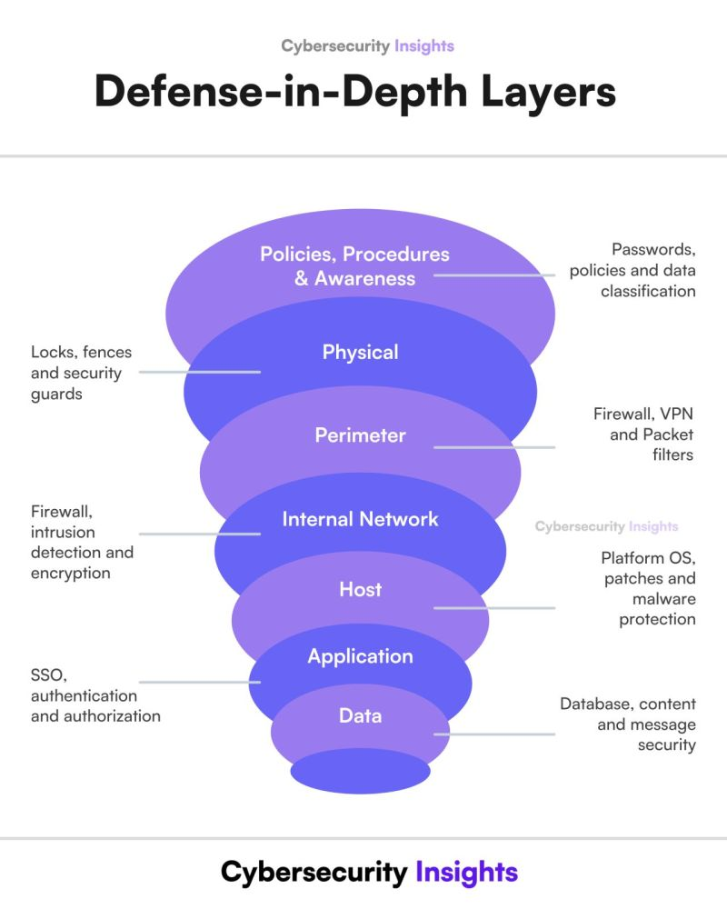
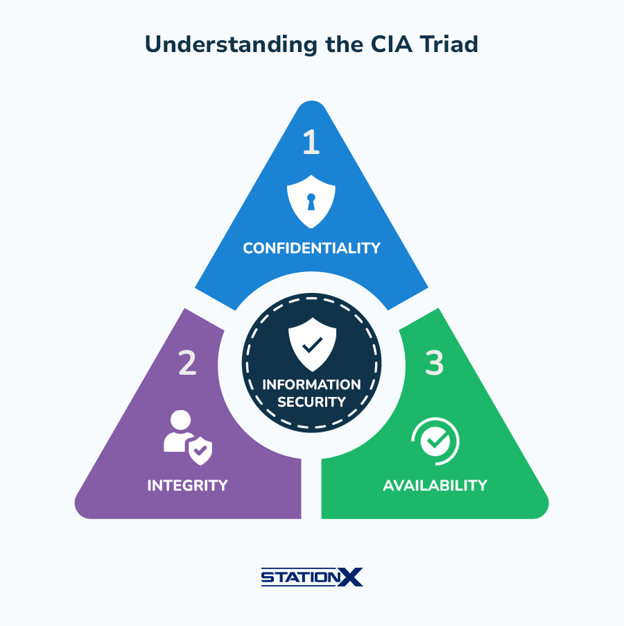
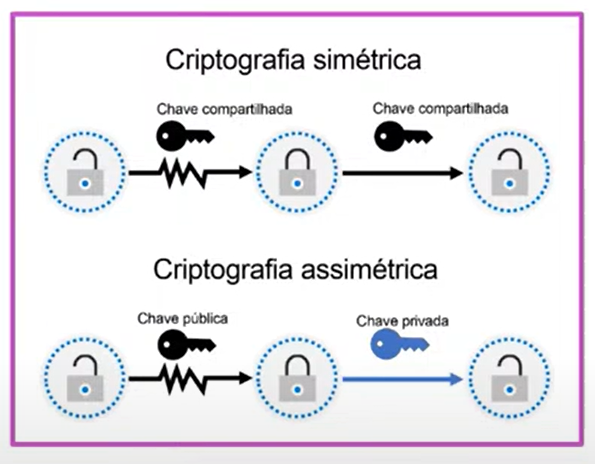
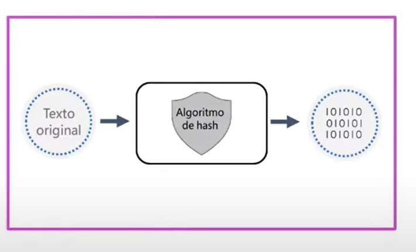
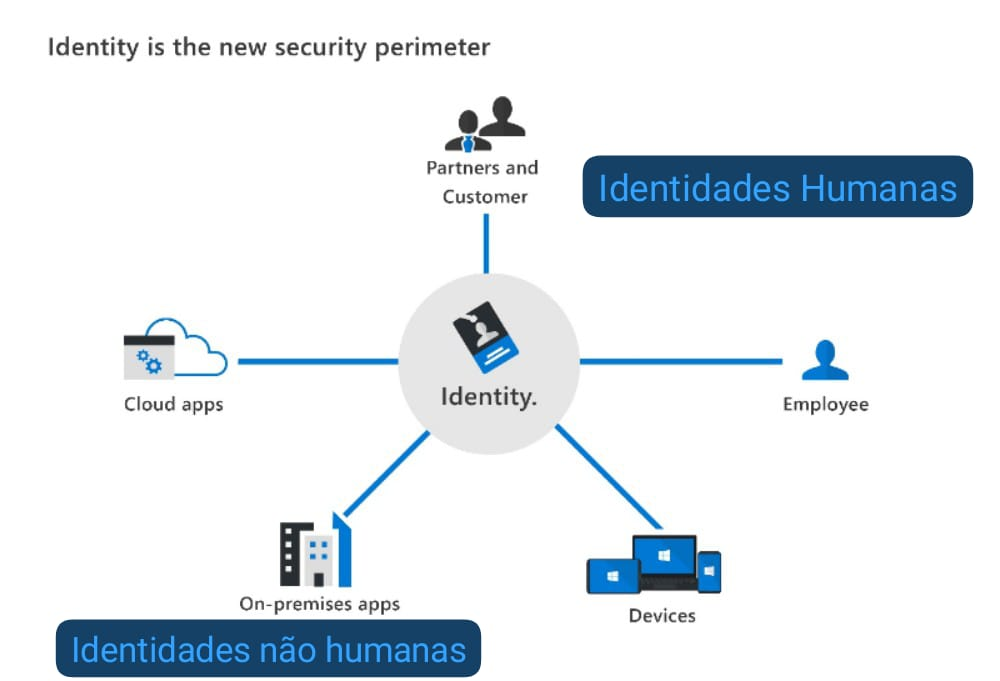
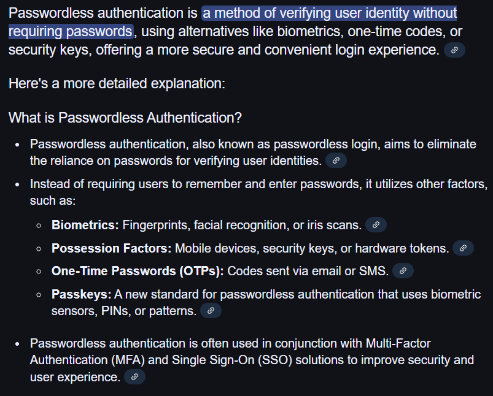
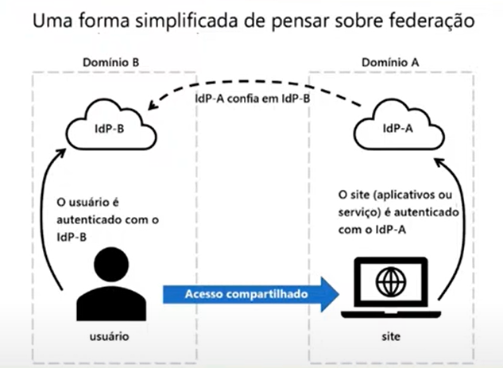

<!--Habilidades medidas pelo Exame e percentual de quanto cai na prova.

Descrever os conceitos de segurança, conformidade e identidade = 10 a 15%.
Descrever as capacidades do Microsoft Entra = 25 a 30%.
Descrever as funcionalidades das soluções de segurança da Microsoft =  25 a 30%.
Descrever as funcionalidades do Microsoft Priva e do Microsoft Purview = 25 a 30%.

---------------------------------------------------------------------------------------
Aula 01:
Conceitos de Segurança e conformidade
Conceitos de identidade -->

----------------------------------------------------------------------------------------

# Módulo 01 - Conceitos de Segurança e conformidade

- Modelo de responsabilidade compartilhada

As reponsabilidades variam dependendo de onde está a Workload:

    - SaaS (Software as a Service - Software como serviço)
    - PaaS (Platform as a Service - Plataforma como serviço)
    - IaaS (Infrastructure as a Service - Infraestrutura como serviço)
    - Datacenter local

## Defense-in-depth (DiD) - Defesa em Profundidade

A defense-in-depth usa uma abordagem em camadas para a segurança, os exemplos incluem:

 - Segurança física (Physical): Locks, fences and security guards | limitar o acesso a um datacenter somente ao pessoal autorizado.

 - Segurança de identidade e acesso(Policies, procedures and awareness): Passwords, policies and data classification | Controla o acesso à infraestrutura e o controle de alterações.

 - Segurança de perímetro (perimeter): Firewall, VPN and Packet filters | proteção contra DDoS(negação de serviõ distribuída) para filtrar ataques em grande escala antes que eles possam causar uma interrupção para os usuários.

 - Segurança de rede(internal network): Firewall intrucion detection and encryption | limita a comunicação entre recursos por meio da segmentação e dos controles de acesso.

 - Segurança da camada de computação(Host): Platform OS, patches and malware protection | protege o acesso a máruinas virtuais fechando determinadas portas.

 - Segurança da camada de aplicativo(App): SSO, authentication and authorization | verifica se os aplicativos estão seguros e livres de vulnerabilidades.

 - Segurança da camada de dados(Data): Database, content and message security | controla o acesso a dados comerciais e de clientes e usa criptografia para proteger dados.

## CIA / CID - Confidentiality, Integrity, and Availability | Confiabilidade, Integridade E Disponibilidade
### A Triade da Segurança Cibernética!

CIA - os objetivos de uma estratégia de segurança cibernética. - Base da segurança da informação.

 *Confidentiality | Confidencialidade*: Garantia que dados confidenciais como informações do cliente, permaneçam confidenciais.

 *Integrity | Integridade*: Garantia que dados ou mensagens não tenham sido adulterados.

 *Availability | Disponibilidade*: Significa a disponibilização de dados àqueles que precisam deles.

 ## O Modelo Zero Trust

 #### Princípios de orientação de Zero Trust (Confiança 0)

  - Verificação explícita
  - Acesso com privilégio Mínimo
  - Assumir violação

#### Seis pilares fundamentais
  - As **identidades** (humana e não humana) e podem ser usuários, serviços ou dispositivos.
  - Os **dispositivos** (máquinas - windows, linux, mac | android, Ios)criam uma grande superfície de ataque à medida que os dados fluem, diferentes dispositivos necessitam de diferentes tipos de controle, não conseguimos colocar as mesmas politicas de proteção para todos.
  - Os **aplicativos** (SaaS)são a maneira como os dados são consumidos.
  - Os **dados** devem ser classificados, rotulados e criptografados.
  - A **infraestrutura** se representa um vetor de ameaça.
  - AS **redes** devem ser segmentadas, acessando apenas o que devem acessar.

## Criptografia

  Processo de tornar os dados ilegíveis e inutilizáveis para visualizadores não autorizados.
  - Criptografia de dados em repouso (não utilizados no momento).
  - Criptografia de dados em trânsito (dados que estão sendo tranferidos).
  - Criptografia de dados em uso (dados em cache, não está parado, mas também não está em transito).

  Dois tipos de criptografia de nível superior:|
  - Simétrico - usa a mesma chave para criptografar e descriptografar dados.
  - Assimétrico - usa uma chave pública e um par de chaves privadas.
  

## Hash
  
  O hash usa um algoritmo para converter o texto original em uma valor de hash exclusivo de comprimento fixo. As funções do hash são:
  
   - Determinísticas, a mesma entrada produz a mesma saída.
   - Um identificador exclusivo de dados associados.
   - Diferente da criptografia, o valor de hash não é descriptografado posteriormente para o original.
   - Usado para armazenar senhas; a senha "tem sal" para resudir o risco de ataque de dicionário de força bruta.
  
  A proteção por hash, tem um nível de proteção um pouco maior do que a senha normal.
  

## Conceitos de governança, conformidade e risco (GRC - Governance, Risk Management, and Compliance)

 O GRC ajuda as organizações a reduzir o risco e melhorar a eficárica da conformidade.

   - Governança - AS regras, práticas e processos que uma organização usa para direcionar e controloar suas atividades.
   - Gerenciamneto de riscos - O processo de identificar, avaliar e responder a ameaças ou eventos que podem afetar os objetivos de negócios.
   - Conformidade - O país/região, as leis estaduais ou federais ou até mesmo as regulamentações multinacionais que uma organização precisa seguir.

   

**A SEGURANÇA CIBERNÉTICA É UMA PARTE DA SEGURANÇA DA INFORMAÇÃO!**

# Módulo 02 - Conceitos de identidade

IDP - Identity Provider verifica a autenticação e a autorização do "indivíduo".

## Autenticação e autorização
 
 #### Autenticação (AuthN)
 A autenticação é o processo de provar que uma pessoa é quem ela diz ser. A autenticação **permite acesso**.

 #### Autorização (AuthZ)
 A autorização determina o **nível de acesso ou as permissões** que uma pessoa autenticada tem aos seus dados e recursos.

## Identidade como o perímetro de segurança primário
 A identidade se tornou o novo perímetro de segurança, que permite que as organizações protejam os ativos.

 Uma identidade, que pode ser usada para autenticar e autorizar alguém ou algo, pode estar associada a:
 - Usuário
 - Aplicativo
 - Dispositivo
 - Outro

 Quatro pilares de uma infraestrutura de identidade:
 - Administração
 - Autenticação
 - Autorização
 - Auditoria(logs de acesso precisam ser guardados)

 

 Identidade Humana - funcionários, parceiros, clientes, etc.

 Identidades não humanas - Aplicativos locais, dispositivos, aplicativos em núvem.

 Como as identidades não humanas não tem e-mail e senha, precisa-se de uma forma de **autenticação moderna**.

## A autenticação moderna e a função do provedor de identidade
 
 **Autenticação moderna** é um termo abrangente para os métodos de autenticação e autorização entre um cliente e um servidor.

 A autenticação moderna permite uma senha complexa, permite autenticação em dois fatores, passwordless, etc.

 1. A função de **provedor de identidade (IdP)** está no centro da autenticação moderna, visto que **não se limita apenas a identidade humana**.
 2. O Idp oferece serviços de autenticação, autorização e auditoria.
 3. O Idp permite que as organizações estabeleçam políticas de autenticação e autorização, monitorem o comporamento do usuário e muito mias.
 4. Os recursos básicos de um Idp e a "autenticação moderna" incluem suporte para **métodos de autenticação seguros, logon único, federação com outros Idps** e muito mais.
 5. O Microsoft Entra ID é um exemplo de um provedor de identidade baseado em nuvem.

## O conceito de serviços de diretório

 - 🔒 Um diretório é uma estrutura que armazena informações sobre objetos na rede.
 - 🛡️ Um serviço de diretório armazena dados de dizerótio e os disponibiliza para os usuários de rede, administradores, serviços e aplicativos.
 - 🗄️ O serviço desse tipo mais conhecido é o AD DS(Active Directory Domain Services), um componente central das organizações com infraestrutura de TI local.
 - 🔑 O Microsoft Entra ID é a evolução das soluções de gerenciamento de identidade e acesso, fornecendo às organizações uma solução de identidade como serviços (IdaaS - Identity as a Service) para todos os seus aplicativos na nuvem e no local.

## O conceito de Federação

 Uma maneira simplificada de pensar sobre federação:

 - O site usa os serviços de autenticação do provedor de identidade A (IdP-A).
 - O usuário é autenticado com o provedor de identidade B (IdP-B).
 - O IdP-A tem uma relação de confiança configurada com o IdP-B.
 - Quando o usuário entra no site, ele pode confiar nas credenciais do usuário e permitir acesso.

 

